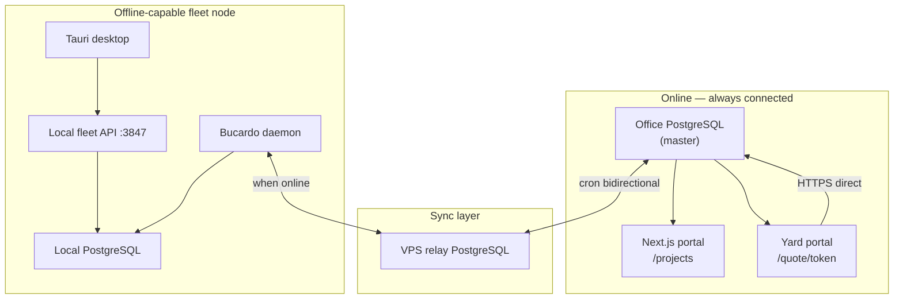

# Platform plan — RBAC + online/offline dual mode

This document merges **Phase 1 RBAC** with **superintendent offline-first** operation. It extends [sync/ARCHITECTURE.md](./sync/ARCHITECTURE.md) and [sync/IMPLEMENTATION-PHASES.md](./sync/IMPLEMENTATION-PHASES.md).

---

## Core principle

> Superintendents must run the full tender workflow **without network**. When connectivity returns, the system **syncs automatically** to office — with clear status, conflict handling, and permission enforcement on both sides.

| Mode | Where data lives | Who uses it |
|------|------------------|-------------|
| **Online** | Office PostgreSQL (master) | Office portal, yard portal, MD dashboards |
| **Offline** | Local PostgreSQL on superintendent/ship laptop | Tauri desktop + local fleet API |
| **Hybrid** | Local DB + background Bucardo sync | Superintendent at yard with intermittent Wi‑Fi |

**No compare/spec/quote code path may require live office HTTPS** on fleet nodes. Network is for **sync and auth refresh**, not for routine reads/writes.

---

## Dual-mode architecture



### Authority rules (unchanged from sync architecture)

| Data | Master when online | Offline behaviour |
|------|-------------------|-------------------|
| Locked spec (`owner_locked`) | Office wins on merge | Edits blocked locally or queued as draft |
| Yard portal quotes | Office | Read-only locally until sync pulls |
| Superintendent project edits | Local until sync | Push on reconnect; office may reject if status closed |
| User/role changes | Office | Cached snapshot on device; refresh on sync |

---

## What must work offline (superintendent)

| Capability | Offline | Notes |
|------------|:-------:|-------|
| Open assigned projects | ✓ | Filtered by `vessel_id` + user scope |
| View/edit spec (unlocked lines) | ✓ | Writes to local Postgres |
| Manage categories | ✓ | Sync up; office template may override system cats |
| View comparison matrix | ✓ | From local `quote_lines` + snapshots |
| Export comparison Excel | ✓ | Generated locally |
| Create project | ✓* | *Queued if org policy requires online approval |
| Invite shipyard | ◐ | Create invite locally; **token email needs online** or queue |
| Yard quote submit | ✗ | Yard portal is online-only → office DB |
| User/role admin | ✗ | Office only |
| MD fleet-wide analytics | ✗ | Office/online dashboards |

When a yard submits online while superintendent is offline, comparison **updates locally after next Bucardo pull** — UI should show “New yard data — sync to refresh” if local `office_changed_at` is stale.

---

## RBAC design (permission matrix + scope)

Roles are **templates**; authorization checks **permissions + scope + limits**.

### Scope dimensions

| Scope | Example |
|-------|---------|
| `organization` | Company Admin — all projects |
| `vessel` | Tech Supdt — `vessel_id IN assigned` |
| `project` | Purch Officer — one tender only |
| `yard_invite` | Shipyard — single token/project |

### Phase 1 permission catalog (tender module)

```
project.create / project.read / project.delete / project.status.change
spec.read / spec.edit / spec.import / spec.lock
category.read / category.edit
yard.invite / yard.revoke / yard.view
quote.read.summary / quote.read.detail
comparison.view / comparison.export
tender.shortlist / tender.award
org.user.manage / org.role.manage
audit.read
device.register
sync.view_status
```

System templates (clone per company): Company Admin, Technical Manager, Technical Superintendent, Purchasing Manager, Purchasing Officer, Managing Director, Shipyard (external).

---

## RBAC in offline mode (additional requirements)

Offline RBAC cannot call office on every click. Plan for:

### 1. Device registration

- Each superintendent laptop = `FleetDevice` (id, org, node type, vessel scope, public key)
- Registered by Company Admin while **online**
- Device certificate or long-lived refresh token bound to device + user

### 2. Cached permission snapshot

On login (or sync), download:

```json
{
  "userId": "...",
  "organizationId": "...",
  "roles": ["technical_superintendent"],
  "permissions": ["project.read", "spec.edit", "comparison.view", ...],
  "scopes": { "vesselIds": ["..."], "projectIds": ["..."] },
  "limits": { "tender.award": { "maxUsd": 25000 } },
  "validUntil": "2026-06-13T00:00:00Z",
  "policyVersion": 42
}
```

Stored in local Postgres (`auth_snapshot` table) or encrypted local file.

- App checks `can(action, resource)` against snapshot **offline**
- If `validUntil` expired and offline → **read-only** (configurable) or grace period (e.g. 72h)
- On sync: refresh snapshot; revoked users fail next API call

### 3. Auth tables — sync manifest split

| Table | Sync to fleet? | Reason |
|-------|:--------------:|--------|
| `organizations` | ✓ | Tenant name, settings |
| `users` (minimal) | ✓ | id, name, email hash — no password hash to ship |
| `role_assignments` | ✓ | Scope for project list |
| `permissions` / `role_permissions` | ✓ | Small catalog |
| `sessions` | ✗ | Office/device local only |
| `audit_log` | ↑ push only | Fleet pushes actions; office never syncs down full log |
| `password_credentials` | ✗ | Office SSO only |

### 4. Offline login

| Method | Use |
|--------|-----|
| **Online first** | Email + password / SSO → issue device refresh token |
| **Offline thereafter** | PIN or OS biometrics + cached snapshot |
| **Break-glass** | Company Admin one-time offline codes (audited) |

Shared `OFFICE_AUTH_PASSWORD` is **retired** when Phase F completes.

### 5. Action audit offline

Every mutating action writes to local `audit_log` with `origin_node = superintendent|ship`. Rows sync **up** to office on reconnect for compliance.

---

## Sync behaviour (online ↔ offline)

### Automatic sync triggers

| Trigger | Action |
|---------|--------|
| Network restored (OS event) | Bucardo delta sync + permission snapshot refresh |
| App foreground | Check last sync > N minutes → prompt or auto-sync |
| Manual “Sync now” button | User-initiated full delta |
| Before sensitive action | Optional “sync first” if pending outbound queue |

### UI requirements (desktop)

- **Connection badge**: Offline / Syncing / Up to date / Conflict
- **Last sync time** + pending outbound change count
- **Conflict queue** for spec/quote rows (from ARCHITECTURE conflict rules)
- Disable or warn when acting on stale yard data

### Outbound queue (optional enhancement)

For actions that must reach office before taking effect (e.g. `tender.award`):

- Write locally as `status = pending_sync`
- Promote to `approved` when office acks via sync round-trip
- Prevents “awarded offline” diverging from office state

---

## Updated implementation phases

Phases A–E (relay, local-apps, sidecar, office auth, shipyard) are **done** — see [IMPLEMENTATION-PHASES.md](./sync/IMPLEMENTATION-PHASES.md).

New work is **F → K**, designed so offline and RBAC land together where they intersect.

### Phase F — Identity & RBAC foundation (office, online)

**Goal:** Real users, org tenancy, permission checks on office portal.

| Task | Priority |
|------|----------|
| Prisma: `Organization`, `User`, `Role`, `Permission`, `RolePermission`, `UserRole`, `AuditLog` | P0 |
| Add `organizationId` to `Project`, `YardInvite` | P0 |
| Replace shared password with user login + session per user | P0 |
| `lib/auth/authorize.ts` — `can(user, permission, resource)` | P0 |
| Protect all `/api/projects/*` routes | P0 |
| Seed system role templates + permission catalog | P0 |
| Company Admin UI: invite user, assign role, vessel/project scope | P1 |

**Exit criteria:** Two users in same org see different menus; API returns 403 without permission.

---

### Phase G — Offline-first fleet node (no RBAC yet)

**Goal:** Superintendent desktop 100% on local Postgres; sync when online.

| Task | Priority |
|------|----------|
| Prisma migrations on local DB = same schema as office | P0 |
| Bucardo ship + superintendent dbgroups (manifest in ARCHITECTURE) | P0 |
| VPS relay live (Phase 2 in ARCHITECTURE) | P0 |
| Desktop: all reads/writes via local fleet API only | P0 |
| Remove any “call office API” paths from desktop | P0 |
| Sync status panel: last sync, pending changes, online/offline | P0 |
| Conflict queue UI (spec lock, quote mismatch) | P1 |
| Install guides tested air-gapped (no internet except sync window) | P1 |

**Exit criteria:** Laptop unplugged for 8h — create project, edit spec, view comparison, export; plug in — data appears on office portal.

---

### Phase H — RBAC on fleet nodes (offline-capable auth)

**Goal:** Permission checks on desktop; snapshot sync; device registration.

| Task | Priority |
|------|----------|
| `FleetDevice` model + registration flow | P0 |
| Auth snapshot download endpoint (office) | P0 |
| Local `auth_snapshot` storage + `can()` on fleet API | P0 |
| Offline login (PIN/biometric + snapshot) | P0 |
| Filter project list by user scope | P0 |
| Sync manifest: org, users (minimal), roles, assignments | P0 |
| Revoke user → fails on next sync / snapshot refresh | P0 |
| Local audit log → sync up | P1 |

**Exit criteria:** Tech Supdt offline sees only assigned vessels; Purch Officer cannot edit spec; revoked user blocked after sync.

---

### Phase I — Approvals & policy limits

**Goal:** Award/shortlist gates + monetary limits; offline queue for critical actions.

| Task | Priority |
|------|----------|
| `ApprovalPolicy` per org (amount thresholds, dual approval) | P1 |
| Project status workflow enforced by permission + policy | P1 |
| `pending_sync` state for award offline (optional queue) | P2 |
| Email notifications (online) | P2 |

---

### Phase J — External identities

**Goal:** Shipyard/vendor/class/auditor — scoped, no fleet leakage.

| Task | Priority |
|------|----------|
| Shipyard: extend token model → yard user account (optional) | P1 |
| Vendor portal (separate from shipyard) | P2 |
| Time-boxed auditor access | P2 |
| Client read-only dashboard | P2 |

---

### Phase K — Platform admin (Developer Admin)

**Goal:** Multi-tenant ops — licenses, feature flags, break-glass.

| Task | Priority |
|------|----------|
| System tenant + Developer Admin console | P2 |
| Feature flags per org (`sync.enabled`, `modules.ai`) | P2 |
| License/seat enforcement | P2 |

---

## Phase dependency graph

```text
A–E (done) ──► F (RBAC office) ──► H (RBAC fleet)
                    │
G (offline DB) ─────┴──► H
                    │
                    └──► I (approvals) ──► J (external) ──► K (platform)
```

**Recommended parallel track:**

- **Track 1:** Phase F (office RBAC) — unblocks multi-user portal now  
- **Track 2:** Phase G (offline local Postgres + Bucardo) — unblocks superintendent at yard  
- **Merge at Phase H** — auth snapshot + scoped offline access  

---

## Non-functional requirements

| Requirement | Target |
|-------------|--------|
| Offline startup | App usable ≤ 5s without network |
| Sync latency | Delta sync ≤ 2 min after network up (Bucardo + relay cron) |
| Data loss | Zero on clean shutdown; outbound queue survives crash |
| Permission staleness | Max 24h offline grace; then read-only |
| Security | Passwords never synced to ship; TLS to office; device binding |
| Audit | All spec edits, awards, exports logged with user + node |

---

## Schema additions (summary)

```text
Organization
User (organizationId, email, status)
Role (organizationId nullable)
Permission (key, module)
RolePermission (roleId, permissionId, conditionsJson)
UserRole (userId, roleId, scopeType, scopeId)
FleetDevice (organizationId, userId, nodeType, lastSyncAt)
AuthSnapshot (deviceId, policyVersion, payloadJson, validUntil)
AuditLog (actorId, permission, resourceType, resourceId, originNode, …)
ApprovalPolicy (organizationId, action, minAmount, roleChain)

Project.organizationId  — add
YardInvite.organizationId — add (denormalized for RLS)
```

---

## Success metrics

| Phase | Metric |
|-------|--------|
| F | 100% project API routes check permissions |
| G | 1 full offline day at yard → office sync match |
| H | Role change on office reflected on device ≤ 1 sync cycle |
| I | Award above limit blocked without MD role |
| J | Shipyard user HTTP 404 on other projects |

---

## Related docs

- [ARCHITECTURE.md](./sync/ARCHITECTURE.md) — five-node topology, Bucardo manifest, conflict rules  
- [IMPLEMENTATION-PHASES.md](./sync/IMPLEMENTATION-PHASES.md) — completed phases A–E  
- [INSTALL-SUPERINTENDENT.md](./sync/INSTALL-SUPERINTENDENT.md) — fleet node install  
