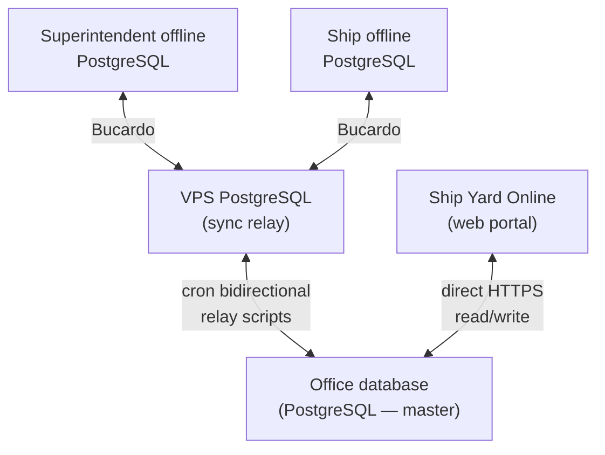

# Actinium-DD — System Architecture

This document defines the **five-node topology** for Actinium-DD: online office portal, VPS sync relay, two offline PostgreSQL nodes (superintendent + ship), and yard online direct to office.

It replaces the earlier SQLite-only desktop approach. **All nodes use PostgreSQL** with the same Prisma schema; sync is **database replication via VPS relay**, not app-level REST blob sync.

---

## Topology (your diagram)



| Node | Role | App | Database | Connectivity |
|------|------|-----|----------|--------------|
| **Office database** | Master source of truth; tender management | Next.js portal (`/projects`) | PostgreSQL (office) | Always online |
| **VPS PostgreSQL** | Sync relay / staging between office and fleet | Relay cron scripts only | PostgreSQL (`drydock_sync_relay`) | Always online |
| **Superintendent offline PostgreSQL** | Superintendent laptop at yard or in port | Tauri desktop → local Postgres | PostgreSQL (local) | Offline most of the time; syncs via VPS when online |
| **Ship offline PostgreSQL** | Vessel installation (same app, ship profile) | Tauri desktop → local Postgres | PostgreSQL (local) | Offline at sea; syncs in port via VPS |
| **Ship Yard Online** | Yard quote submission (no Bucardo) | Next.js `/quote/[token]` | **Connects to Office DB** | Always online when yard uses portal |

### Why yard connects direct to office (not VPS)

- Yards are external, intermittent users — they need a simple HTTPS URL, not fleet sync infrastructure.
- Yard writes (portal form, Excel upload) land on **office master** immediately.
- Ship and superintendent **pull** yard data through the normal chain:  
  `Office → VPS relay → Bucardo → local Postgres`.

---

## Sync legs (same pattern as app-pms-updated)

Reuse the proven **Relay + Bucardo** model from PMS (`docs/sync/RELAY-BUCARDO-RUNBOOK.md` in app-pms-updated).

| Leg | Mechanism | Runs on |
|-----|-----------|---------|
| Office ↔ VPS relay | `relay-sync-office-bidirectional.sh` (cron ~2 min) | VPS |
| Superintendent ↔ VPS | Bucardo `superintendent_to_relay` / `superintendent_from_relay` | Superintendent PC |
| Ship ↔ VPS | Bucardo `ship_to_relay` / `ship_from_relay` | Ship PC |

**Do not** use HTTPS row-by-row sync as the primary path when Bucardo is active (same rule as PMS: `DB_SYNC_ENGINE=bucardo` disables HTTP incremental sync).

### Data flow examples

**Superintendent uploads yard Excel offline**

```
1. Tauri app writes to local PostgreSQL (projects, yard_invites, quote_lines, compare_snapshots)
2. When online: Bucardo pushes local changes → VPS relay
3. VPS cron pushes relay → Office master
4. Office portal shows updated comparison
```

**Yard submits quote via portal**

```
1. Yard browser → Office PostgreSQL (quote_lines, quote_meta)
2. VPS cron pulls office changes → relay
3. Bucardo on ship/superintendent pulls relay → local PostgreSQL
4. Desktop app shows yard submission in comparison matrix
```

**Office edits tender spec**

```
1. Portal updates spec_lines on Office DB
2. Relay → VPS → Bucardo → ship/superintendent local DB
3. Locked spec lines overwrite local copies (owner authority)
```

---

## Canonical schema (one DDL everywhere)

**Source of truth for DDL:** `prisma/schema.prisma` + migrations.

Every node runs the **same migrations**:

- Office PostgreSQL  
- VPS relay PostgreSQL (clone/seed from office, then kept in sync)  
- Superintendent local PostgreSQL  
- Ship local PostgreSQL  

### Sync metadata (add to all syncable tables)

Required for Bucardo delta sync and conflict auditing (mirror PMS `changed_at` pattern):

```sql
-- On every table in sync manifest
origin_node     TEXT NOT NULL DEFAULT 'office'   -- office | vps | superintendent | ship | yard
changed_at      TIMESTAMPTZ NOT NULL DEFAULT now()
deleted_at      TIMESTAMPTZ                        -- soft delete / tombstone
```

Optional per deployment:

```sql
-- On projects (link fleet identity)
vessel_id         TEXT                             -- fleet vessel identifier
superintendent_id TEXT                             -- device/user id for superintendent node
```

Triggers: `BEFORE UPDATE` → set `changed_at = now()` on every syncable table (same as PMS relay install scripts).

---

## Sync manifest — tables in Bucardo

Start with tender domain only. Do **not** sync Next.js session/cache tables.

| Table | Sync | Notes |
|-------|------|-------|
| `projects` | ✅ | Core tender project |
| `spec_lines` | ✅ | Owner spec; office wins when `owner_locked` |
| `yard_invites` | ✅ | Yard tokens generated on office; replicated down |
| `quote_meta` | ✅ | Per-yard quote header |
| `quote_lines` | ✅ | Portal + Excel imports |
| `compare_snapshots` | ✅ **new** | Hull/dry-dock/yard parsed Excel state (JSON per vendor) |
| `sync_tombstones` | ✅ **new** | Explicit deletes for Bucardo (PMS pattern) |

### New table: `compare_snapshots`

Stores rich parsed compare state currently trapped in desktop `snapshot_json`:

```prisma
model CompareSnapshot {
  id          String   @id @default(cuid())
  projectId   String   @map("project_id")
  inviteId    String?  @map("invite_id")   // link to yard_invites when known
  vendorName  String   @map("vendor_name")
  fileName    String   @map("file_name")
  snapshot    Json     // CompareAppSnapshot subset
  originNode  String   @default("ship") @map("origin_node")
  changedAt   DateTime @default(now()) @map("changed_at")
  deletedAt   DateTime? @map("deleted_at")

  project Project @relation(...)
  @@map("compare_snapshots")
}
```

This lets ship/superintendent sync hull-paint intelligence without normalizing every prep line to SQL on day one.

### Yard online — tables touched directly on office

| Route | Writes to office |
|-------|------------------|
| `/quote/[token]` | `yard_invites`, `quote_lines`, `quote_meta` |
| `/api/quote/[token]/upload` | same + `compare_snapshots` (optional, after Excel parse on server) |

No Bucardo on yard side — yard never sees VPS or ship DB.

---

## Application per node

| Node | Application | `DATABASE_URL` points to |
|------|-------------|--------------------------|
| Office | Next.js (`npm run dev` / deployed) | Office PostgreSQL |
| VPS | Cron scripts only (no UI) | Relay DB + office URL in env |
| Superintendent | Tauri desktop (`desktop/`) | `localhost` PostgreSQL |
| Ship | Tauri desktop (same build, `NODE_PROFILE=ship`) | `localhost` PostgreSQL |
| Yard | Next.js `/quote/*` (hosted with office app) | Office PostgreSQL |

### Tauri desktop change (from current SQLite MVP)

| Current (`desktop/`) | Target |
|----------------------|--------|
| SQLite via `@tauri-apps/plugin-sql` | Local **PostgreSQL** (Docker or native install) |
| Blob `snapshot_json` in SQLite | Normalized tables + `compare_snapshots` |
| No sync | Bucardo daemon syncing to VPS when online |

Desktop app becomes a **thin client over local Postgres** — same Prisma queries as portal, works fully offline because DB is local.

---

## VPS relay setup (new for this project)

Clone PMS relay layout under `scripts/relay/` and `docs/sync/`:

```
scripts/relay/
  deploy-to-vps.sh
  relay-clone-from-office.sh
  relay-sync-office-bidirectional.sh
  relay-install-changed-at-triggers.sh

docs/sync/
  ARCHITECTURE.md          ← this file
  RELAY-BUCARDO-RUNBOOK.md ← adapt from PMS
  bucardo-relay-manifest.txt
  bucardo-relay-postgres-grants.sql
  relay-installation.local.env.example
```

Relay database name (suggested): `drydock_sync_relay`

Environment on VPS:

```bash
OFFICE_DIRECT_DATABASE_URL=postgresql://...@office-host/actinium_dd
RELAY_DATABASE_URL=postgresql://...@localhost/drydock_sync_relay
```

Cron (VPS):

```cron
*/2 * * * * /root/relay-sync-office-bidirectional.sh >> /var/log/drydock-relay-sync.log 2>&1
```

---

## Bucardo on ship / superintendent

Two Bucardo sync groups per offline node (same as PMS vessel pilot):

| Group | Direction |
|-------|-----------|
| `{node}_to_relay` | Local → VPS |
| `{node}_from_relay` | VPS → Local |

Manifest file lists tables in **FK-safe order** (parents before children):

```
projects
spec_lines
yard_invites
quote_meta
quote_lines
compare_snapshots
sync_tombstones
```

Ship and superintendent can share the same manifest; differentiate by `origin_node` column and Bucardo dbgroup naming (`ship_*` vs `superintendent_*`).

---

## Conflict rules (business layer on top of Bucardo)

Bucardo resolves most conflicts at row level by timestamp. Application rules override where needed:

| Data | Authority | Rule |
|------|-----------|------|
| `spec_lines` where `owner_locked = true` | Office | Office row wins on merge |
| `quote_lines` where `match_method = portal` | Yard/office | Server copy wins |
| `quote_lines` where `match_method = excel_auto` | Local node | Push to office; flag for review if spec mismatch |
| `compare_snapshots` | Origin node | `origin_node` field decides; newer `changed_at` wins |
| `projects.status` | Office | Office can advance tendering → comparing → closed |

UI: show **sync status** and **conflict queue** in desktop app when Bucardo reports duplicate key or trigger violations.

---

## Network requirements

| Connection | Purpose | Typical when |
|------------|---------|--------------|
| Ship/Superintendent → VPS | Bucardo sync | In port, yard Wi‑Fi, office LAN |
| VPS → Office | Relay cron | Continuous |
| Yard → Office HTTPS | Portal only | Anytime yard has link |
| WireGuard (optional) | Secure VPS reachability from ship | Same as PMS `WIREGUARD-RELAY-VPS-SETUP.md` |

Offline periods: ship/superintendent apps run 100% against local PostgreSQL — **no code path requires live office connection** for compare workflows.

---

## Implementation phases

### Phase 0 — Schema & docs (current)

- [x] Architecture doc (this file)
- [ ] Add `compare_snapshots`, `sync_tombstones`, sync columns to Prisma
- [ ] Publish `bucardo-relay-manifest.txt` for tender tables
- [ ] Update TARGET.md to reference five-node topology

### Phase 1 — Office + Yard online (exists, harden)

- [ ] Ensure all portal routes write only to office DB
- [ ] Yard token flow tested end-to-end on office DB
- [ ] Export/compare APIs office-only

### Phase 2 — VPS relay

- [ ] Create `drydock_sync_relay` on VPS
- [ ] Port relay scripts from PMS (`scripts/relay/`)
- [ ] Seed relay from office; install `changed_at` triggers
- [ ] Cron office ↔ relay bidirectional sync

### Phase 3 — Local PostgreSQL packaging

- [ ] Ship install guide (Windows/macOS) — Postgres + Bucardo + Tauri
- [ ] Superintendent install guide (same stack)
- [ ] Docker Compose option: `postgres + bucardo + app` for air-gapped install

### Phase 4 — Desktop app → local Postgres

- [ ] Remove SQLite from `desktop/`; connect via Prisma to `localhost` Postgres
- [ ] Migrate `snapshot_json` → `compare_snapshots` + normalized quote tables
- [ ] Bucardo init scripts (`scripts/bucardo/ship-init.sh`, `superintendent-init.sh`)

### Phase 5 — End-to-end sync test

- [ ] Superintendent creates project offline → syncs → visible in office portal
- [ ] Yard submits online → appears on ship after Bucardo pull
- [ ] Office spec edit → overwrites locked lines on ship
- [ ] Conflict UI for excel_auto vs portal on same spec line

---

## What we are NOT doing

| Approach | Reason |
|----------|--------|
| SQLite on ship | Your architecture specifies PostgreSQL on all offline nodes |
| PWA / service worker | Replaced by Tauri + local Postgres |
| Bucardo yard ↔ VPS | Yard is online-only, direct to office |
| App-level REST sync as primary | Postgres replication via relay matches your PMS fleet model |
| Single database for everything | Offline requires local Postgres; office remains master |

---

## Repository layout (target)

```
Actinium-DD/
├── app/                    # Next.js — office portal + yard online
├── prisma/                 # Canonical schema (all nodes)
├── lib/                    # Domain logic (hull, dryDock, tender, sync helpers)
├── components/             # Shared UI
├── desktop/                # Tauri — connects to LOCAL Postgres
├── scripts/
│   ├── relay/              # VPS office ↔ relay (port from PMS)
│   └── bucardo/            # Ship / superintendent init
└── docs/sync/
    ├── ARCHITECTURE.md
    ├── RELAY-BUCARDO-RUNBOOK.md
    └── bucardo-relay-manifest.txt
```

---

## Relation to app-pms-updated

This project **reuses the same sync operations playbook** as PMS:

| PMS asset | Dry dock tender use |
|-----------|-------------------|
| `RELAY-BUCARDO-RUNBOOK.md` | Template for our runbook |
| `relay-sync-office-bidirectional.sh` | Adapt table list + DB names |
| `bucardo-relay-postgres-grants.sql` | Same grants pattern on VPS |
| `bucardo-relay-manifest.txt` | New manifest (tender tables only) |
| WireGuard VPS setup | Optional, same VPN to reach relay at sea |

Different domain tables, **same topology** as your diagram.

---

## Summary

Your five-node diagram is the correct architecture for this project:

1. **Office** — master DB + portal  
2. **VPS** — relay between office and fleet  
3. **Superintendent + Ship** — local PostgreSQL + Tauri + Bucardo  
4. **Yard online** — direct to office, no relay  

Next concrete step: **Phase 0** — extend Prisma schema with sync columns + `compare_snapshots`, then port relay scripts from PMS with the tender table manifest.
